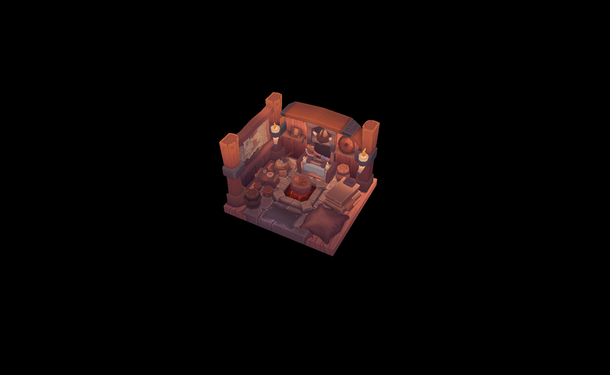
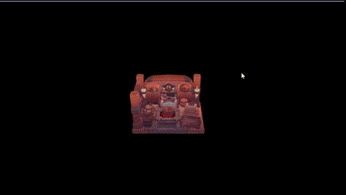

# Murakano

Murakano is a simple renderer implementation written in C++ using Vulkan API.
This project aims to add realtime global illumination rendering features to the applicattion.

If you are interested in my posts about this project, you can check my [devlog](https://github.com/codernineteen/project-2024/tree/main/project-2024/renderer-dev/devlog). 
For anyone who are curious about implementation details, visualized architecture and workflows, Refer to [this repository for documentations](https://github.com/codernineteen/project-2024/tree/main/project-2024/renderer-dev/implementation)

# Features

- Abstractions for Vulkan API
- OBJ format model rendering support
- HLSL, GLSL shader compilation support (HLSL is a default shader language)
- Easy to use Global command service interface
- Vulkan Memory Allocator support

# Planned Features

## Ray tracing

- Acceleration structure 
- Ray tracing pupeline
- ReSTIR
- compute shader 

## Material 

- PBR material implementation

## Denoising

- DLSS

# Examples

- obj model ([viking room model](https://sketchfab.com/3d-models/viking-room-a49f1b8e4f5c4ecf9e1fe7d81915ad38))

- camera movement

| Action          | Key            |
|---|---|
| Move Forward    | W              |
| Move Left       | A              |
| Move Backward   | S              |
| Move Right      | D              |
| Rotate Up       | Arrow Up       |
| Rotate Down     | Arrow Down     |
| Rotate Left     | Arrow Left     |
| Rotate Right    | Arrow Right    |

# Dependencies

- [Vulkan SDK](https://vulkan.lunarg.com/sdk/home)
- [glfw](https://github.com/glfw/glfw/tree/3.3-stable)
- [DirectXMath](https://github.com/microsoft/DirectXMath)
- [DirectXShaderCompiler](https://github.com/microsoft/DirectXMath)
- [tinyobjloader](https://github.com/tinyobjloader/tinyobjloader)
- [stb_image](https://github.com/nothings/stb)
- [fmt](https://github.com/fmtlib/fmt)

# Acknowledgments

- This [cmakeSetup](https://github.com/meemknight/cmakeSetup) repository helped me a lot to setup this project at initial phase